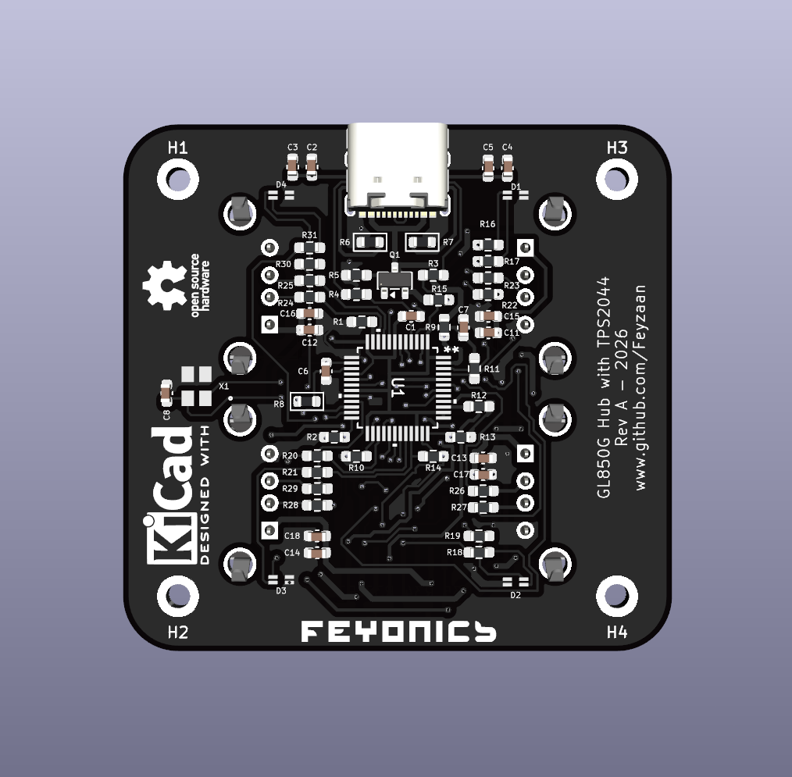
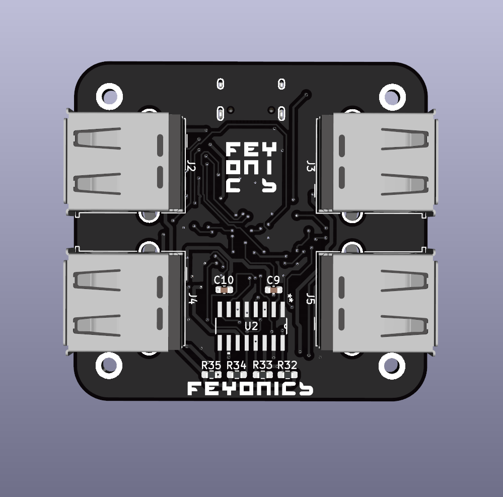
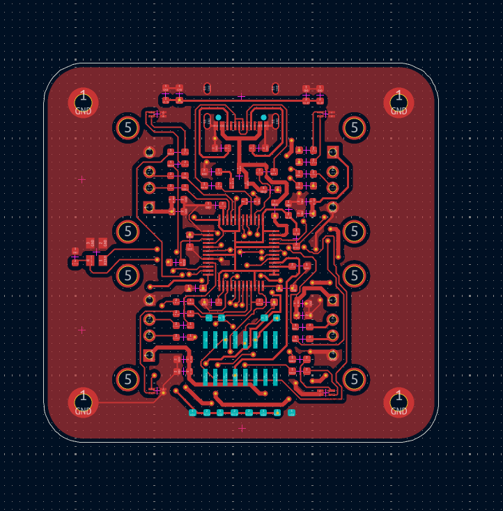
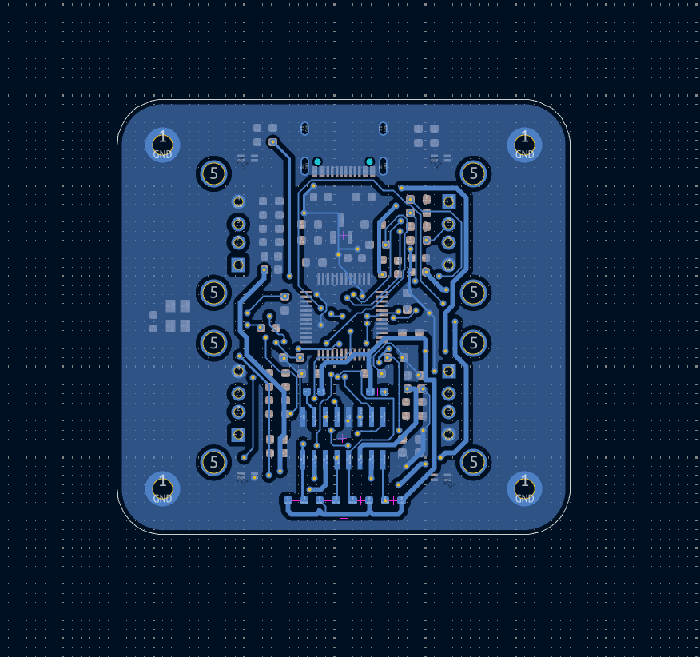

# GL850G + TPS2044B USB Hub — Validation Board

A self-powered, 4-port USB 2.0 hub PCB built to validate independent per-port power switching and fault isolation before use in a larger project. Each downstream port can be individually enabled, current-limited, and fault-reported — a short or overcurrent event on one port never affects the others.

## Overview

Most low-cost USB hubs share power switching across all ports in a single "gang" — one fault trips every port at once. This board is designed the other way: each port has its own dedicated enable and fault-report line, driven by a hub controller running in **individual power mode**, with the actual current-limiting handled by a separate quad power-distribution switch.

This board exists purely to validate that architecture in isolation — no other subsystems, no assumptions carried over from a datasheet reference circuit without independent verification.

## Key Features

- **Independent per-port power switching** — each of the 4 downstream ports has its own enable/fault signal pair, not a shared gang-mode circuit
- **Active overcurrent protection** — a fault on one port trips only that port's power channel; the remaining ports continue operating normally
- **Self-powered architecture** — the hub sources its own downstream power rather than drawing everything from the host's USB port budget
- **Reverse-current protection** — a P-channel MOSFET on the USB-C input blocks the board's local supply from backfeeding into the host
- **USB Type-C current advertisement** — CC-line resistors advertise 1.5 A to the host instead of the USB 2.0 default of 500 mA, using passive resistors only (no PD controller)
- **Per-port status indication** — dual-color LEDs report each port's connection/fault state
- **Independent, isolated crystal oscillators** — the hub controller and any downstream logic run on separate, dedicated clock sources

## Hardware

| Function | Part |
|---|---|
| USB hub controller | Genesys Logic GL850G-MNG21 (LQFP48, individual power mode) |
| Power distribution switch | Texas Instruments TPS2044BDR (quad, independently current-limited channels) |
| Reverse-current blocking | SI2301 P-channel MOSFET |
| Host connector | USB-C (16-pin, reversible) |
| Downstream connectors | 4× USB-A |
| Status indication | Dual-color (green/amber) LEDs, one per port |

## Design Notes

- The hub controller's power-on strap pins configure port count, power-switch polarity, and per-port removable/non-removable status; several of these pins double as status-LED drivers after the strap window closes, requiring careful resistor sizing so the two functions don't interfere with each other.
- Overcurrent-report lines are open-drain and require external pull-ups — this is easy to miss if relying on a symbol's default connections rather than the manufacturer's application circuit.
- Reset sensing is derived from the raw, upstream USB VBUS rail (ahead of the reverse-blocking MOSFET) rather than the board's own regulated rail, so a cable disconnect is detected immediately rather than after the local bulk capacitance discharges.

## Status

Schematic complete and cross-checked pin-by-pin against manufacturer datasheets. PCB fabrication in progress.

## Gallery

**3D render**

  
  

**Copper layers**

  
  

